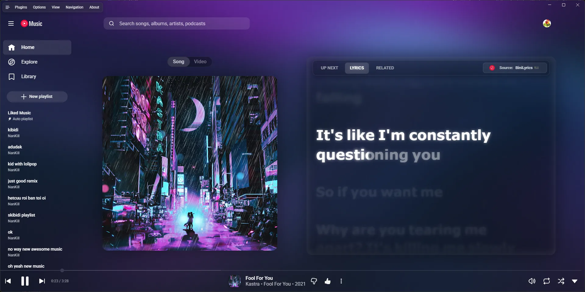

<div align="center">

# 🕶️ Glassy Music

[](https://github.com/NanKillBro/glassy-music-nankill/src/branch/master/LICENSE)
[](https://github.com/NanKillBro/glassy-music-nankill/src/branch/master/eslint.config.mjs)
[](https://github.com/NanKillBro/glassy-music-nankill/releases)

</div>

<div align="center">

**A personalized fork maintained by NanKill**



<p align="center">
    More screenshots: <a href="web/demo/screenshot.md">here</a>
</p>

<hr>

### ✨ What makes this version different?

</div>

Here are the key improvements and features added in this build:

- 🎵 **Better Lyrics Integration:** Added custom themes, bug fixes.
- 🎨 **Better Lyrics Shader:** Enhanced visual effects with fixes.
- 🛡️ **Built-in Adblock:** Enjoy music without interruptions.
- ⏯️ **Non-Stop:** Bypassed the "Video paused. Continue watching?" prompt.
- 🌶️ **Personal Tweaks:** Added some "extra flavor" and customizations to suit my preferences.

---
### ⚠️ Hardware Recommendation

This version includes heavy visual customization. **It is not recommended for very old or low-end hardware.**
- **Windows/Linux:** For the best experience at 1080p60, use a device with at least a **4-core CPU** and decent graphics (Intel UHD/Iris Xe or dedicated GPU). Dual-core CPUs may max out system resources.
- **Mac:** Runs perfectly on Apple Silicon (>M1).
---

### How to use?

- **🚀 Stable Release (Recommended):** You can download the pre-compiled version directly from the **[Releases](https://github.com/NanKillBro/glassy-music-nankill/releases)** page. 
- **🛠️ Latest Experimental:** You can download the latest automated build artifacts from **[GitHub Actions](https://github.com/NanKillBro/glassy-music-nankill/actions)**, or build it from source yourself by following the [Build](#build) section.
- **🐧 Arch Linux (AUR):** You can install the experimental package from AUR using `yay` or `paru`: `yay -S glassy-music-nankill-git` (or `paru -S glassy-music-nankill-git`). Note: A stable package is currently unavailable.

---

> [!IMPORTANT]
> ⚠️ Disclaimer
>
> **No Affiliation**
>
> This project, and its contributors, are not affiliated with, authorized by, endorsed by, or in any way officially connected with Google LLC, YouTube, or any of their subsidiaries or affiliates. **This is an independent, non-profit, and unofficial extension developed by a team of volunteers with the goal of providing a desktop experience.**
>
> **Trademarks**
>
> The names "Google" and "YouTube Music", as well as related names, marks, emblems, and images, are registered trademarks of their respective owners. Any use of these trademarks is for identification and reference purposes only and does not imply any association with the trademark holder. We have no intention of infringing upon these trademarks or causing harm to the trademark holders.
>
> **Limitation of Liability**
>
> This application (extension) is provided "AS IS", and you use it at your own risk. In no event shall the developers or contributors be liable for any claim, damages, or other liability, including any legal consequences, arising from, out of, or in connection with the software or the use or other dealings in the software. The responsibility for any and all outcomes of using this software rests entirely with the user.

> [!NOTE]
> ### 🛑 Before you use or contribute:
> 
> **Built for me, not for everyone:** 
> This fork is heavily "opinionated" and built strictly to satisfy my personal
> visual preferences. I have intentionally stripped out several customization
> features to force a specific, out-of-the-box experience. My goal is for you
> to experience the exact visual aesthetic I intended without needing to
> configure a single thing. If you don't like the hardcoded layout or the
> specific styling, you are highly encouraged to fork the repo and DIY, as
> this project is open-source!
> 
> If you want to tweak the UI, feel free to open a PR! Just make sure to
> include some screenshots or a quick video demo so I can see how it looks.
> I'll review it, and if it matches the vibe I'm going for, I'd love to merge
> it. If it doesn't quite fit, I'll share my thoughts so we can polish it
> together, but please don't be discouraged if it doesn't end up making it in.
> 
> **Heavy "Vibe Coding" & AI Assistance:** 
> This project relies heavily on "vibe coding". As a result, the underlying
> codebase might be unoptimized, and some features may have bugs or break
> randomly. I spent a lot of time tweaking the AI output to make it work, but
> the code architecture might not be perfect. Pull Requests to fix bugs,
> optimize the code, or enhance features are incredibly welcome! Please be
> kind and constructive with your feedback or criticism.

## Content

> [!TIP]
> **Are you a developer?** 
> If you are looking for information on how to set up the development environment, test, or create plugins for this project, please check out the **[Developer Guide (dev.md)](dev.md)**!

- [Build](#build)
- [License](#license)
- [Credits](#credits--acknowledgements)
- [FAQ](#faq)

## Build

### Automated Build (Windows Only)
I provide an automated build script ([`build.bat`](https://github.com/NanKillBro/glassy-music-nankill/blob/master/build.bat)) for Windows that handles everything from A to Z, including checking/installing prerequisites, cloning the repository, installing packages, and compiling the app.

1. Download the [`build.bat`](https://github.com/NanKillBro/glassy-music-nankill/blob/master/build.bat) file to any folder on your computer.
2. Double-click `build.bat` to run it. If it prompts for Administrator privileges (required to install missing NodeJS/Git/pnpm), please allow it.
3. Follow the on-screen prompts to select your build architecture.
4. Once completed, your compiled app will be located in the `glassy-music-nankill/pack` folder.

### Manual Build (Linux, macOS, or Windows)

#### 🛠️ Prerequisites
Before you begin, ensure you have the following installed on your system:
* **[Git](https://git-scm.com/downloads)**: Required to clone the repository.
* **[Node.js](https://nodejs.org/en/download/)**: Please install the **latest version**. Older versions will likely cause build errors.
* **[pnpm](https://pnpm.io/installation/)**: Follow this official guide to install `pnpm` globally on your machine.

#### 🚀 Build Steps

1. **Clone the repository and navigate into the project folder:**
```bash
git clone https://github.com/NanKillBro/glassy-music-nankill
cd glassy-music-nankill
```

2. **Install dependencies:**
Run the following command to cleanly install all required packages:
```bash
pnpm install --frozen-lockfile
```

3. **Build the app for your Operating System:**
   Run the command that matches your target OS:
   * `pnpm dist:win` - Windows
   * `pnpm dist:linux` - Linux (amd64)
   * `pnpm dist:linux:deb-arm64` - Linux (arm64 for Debian)
   * `pnpm dist:linux:rpm-arm64` - Linux (arm64 for Fedora)
   * `pnpm dist:mac` - macOS (amd64)
   * `pnpm dist:mac:arm64` - macOS (arm64)

Builds the app for macOS, Linux, and Windows, using [electron-builder](https://github.com/electron-userland/electron-builder).

### Building in devcontainer

1. Clone the repo;
2. Open the folder in VS Code;
3. Reopen in container when prompted;
4. Run `pnpm build` as above (choosing the desired target);
5. Collect the built files from the `dist` folder.

Since devcontainer uses a mount for the workspace, the built files will be available on the host system as well.

## License

- **GPL-3.0** © [nankill](https://github.com/NanKillBro/glassy-music-nankill)
- Based on [pear-desktop](https://github.com/pear-devs/pear-desktop) ([MIT © pear-devs](NOTICE))

## Credits / Acknowledgements

This project is made possible thanks to the amazing work of the open-source community. A huge thank you to the original creators and contributors of the following projects:

### Core Projects & Features
* **[Pear Desktop](https://github.com/pear-devs/pear-desktop)**: The incredible base application that this fork is built upon.
* **[Better Lyrics](https://github.com/better-lyrics/better-lyrics)**: For the fantastic enhanced lyrics integration.
* **[Better Lyrics Shader](https://github.com/better-lyrics/shaders)**: For the beautiful visual effects and background shaders.
* **[NonStop+](https://chromewebstore.google.com/detail/youtube-nonstop-ch%E1%BA%B7n-t%E1%BB%B1-%C4%91/fboblaiflnpfojmmnenhacobmckefmlh)**: The underlying logic used to bypass the "Video paused" prompts.

### Theme Inspirations
Special thanks to the following creators whose work deeply inspired the **"Merge Theme"**:
* **[chengggit](https://github.com/chengggit)**: Inspiration from the *Dynamic Background* ([YouTube-Music-Dynamic-Theme](https://github.com/chengggit/YouTube-Music-Dynamic-Theme)).
* **zobiron**: Inspiration from the *Big Blurry Slow Lyrics for TV* concept.
* **SKMJi**: Inspiration from the *Luxurious Glass* design.
* **[tposejank](https://github.com/tposejank)**: Inspiration for the lyrics style from the *[Apple Music theme for Better Lyrics](https://github.com/tposejank/blyrics-am-theme)*.
* **[WolfTheE](https://github.com/WolfTheE)**: Inspiration from the *[Better-YTM](https://github.com/WolfTheE/better-ytm)* theme.

## Star History

<a href="https://star-history.com/#NanKillBro/glassy-music-nankill&Date">
 <picture>
   <source media="(prefers-color-scheme: dark)" srcset="https://api.star-history.com/svg?repos=NanKillBro/glassy-music-nankill&type=Date&theme=dark" />
   <source media="(prefers-color-scheme: light)" srcset="https://api.star-history.com/svg?repos=NanKillBro/glassy-music-nankill&type=Date" />
   
 </picture>
</a>

## FAQ

### Why apps menu isn't showing up?

If `Hide Menu` option is on - you can show the menu with the <kbd>alt</kbd> key (or <kbd>\`</kbd> [backtick] if using
the in-app-menu plugin)
